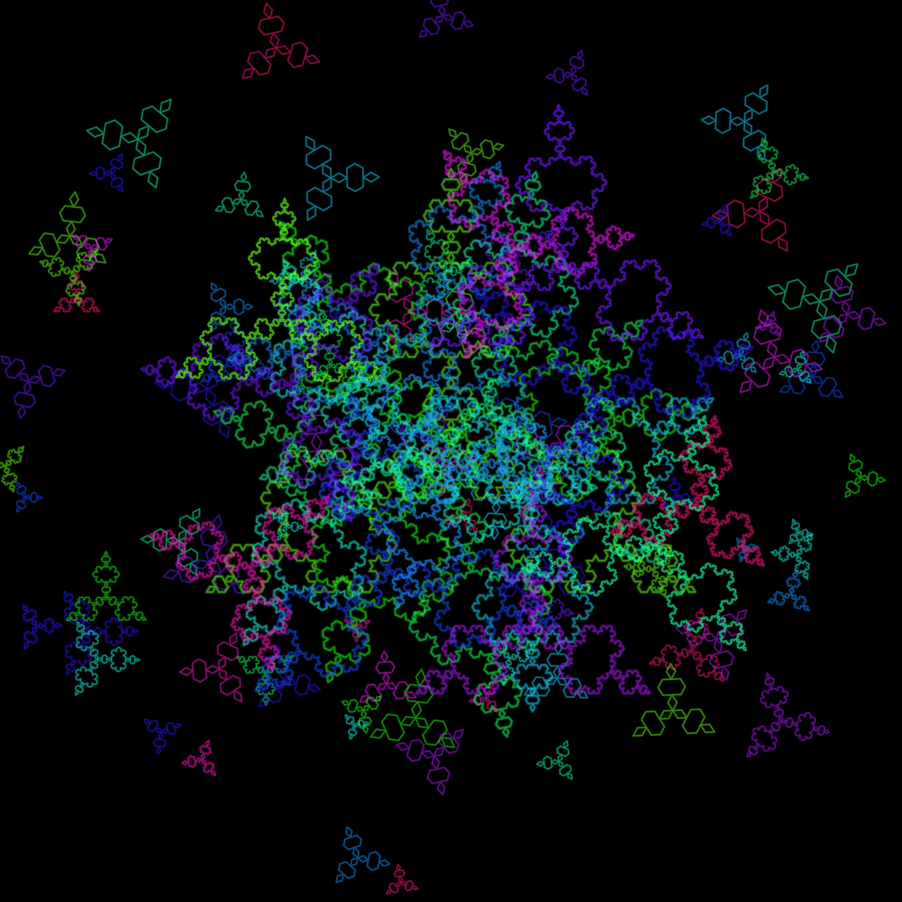

# Koch Snowflake Fractal T-Shirt Design Generator

A Python program that procedurally generates a dense, multi-layered **Koch Snowflake fractal** artwork using recursive geometry and a neon color gradient, exports it as a high-resolution PNG, and uses it as the base artwork for a custom t-shirt design mockup.

## Fractal Type Implemented

- **Koch Snowflake / Koch Curve** — a classic recursive fractal built by repeatedly dividing each line segment into three parts and replacing the middle third with two sides of an equilateral triangle. The project layers many rotated, scaled, and recolored Koch snowflakes (at varying recursion depths) on top of one another to build a dense, all-over decorative pattern.

## Tools, Languages, and Libraries Used

- **Language:** Python 3
- **Libraries:**
  - `numpy` – vector math and point transformations (rotation, scaling, translation)
  - `matplotlib` – rendering the fractal geometry and exporting it as a high-resolution PNG
  - `colorsys` – generating the neon/HSV color gradient palette
  - `random` – randomized placement, sizing, and color selection for the layered snowflakes
- **Other tools:**
  - **Krita** – used to place the exported PNG fractal artwork onto a t-shirt mockup template
  - **Claude (Anthropic)** – used as an AI coding assistant to generate and iteratively refine the fractal-generation source code

## Setup and Run Instructions

### 1. Download the files
Download `koch_tshirt_design.py` from this repository, or use the green **"Code" → "Download ZIP"** button on the GitHub repository page.

### 2. Install dependencies
```bash
pip install numpy matplotlib
```

### 3. Run the script
```bash
python koch_tshirt_design.py
```

### 4. Output
The script generates a high-resolution PNG file (`koch_fractal_tshirt_design.png`) as output. This image was then imported into **Krita** and composited onto a t-shirt template to create the final mockup.

### Customization
You can adjust these parameters inside the script to change the output:

| Parameter | Description |
|---|---|
| `base_depth` | Recursion depth of the main Koch snowflakes (higher = more fractal detail) |
| `layers` | Number of layered snowflakes in the composition |
| `seed` | Random seed — change for a different generated layout |
| `glow_passes` | Number of overlaid strokes used to create the neon glow effect |
| `view_radius` | Controls how tight/dense the overall composition appears |

## Screenshot of Output



## Student Information

- **Name:** Hasnain
- **Registration Number:** CMS 541959
